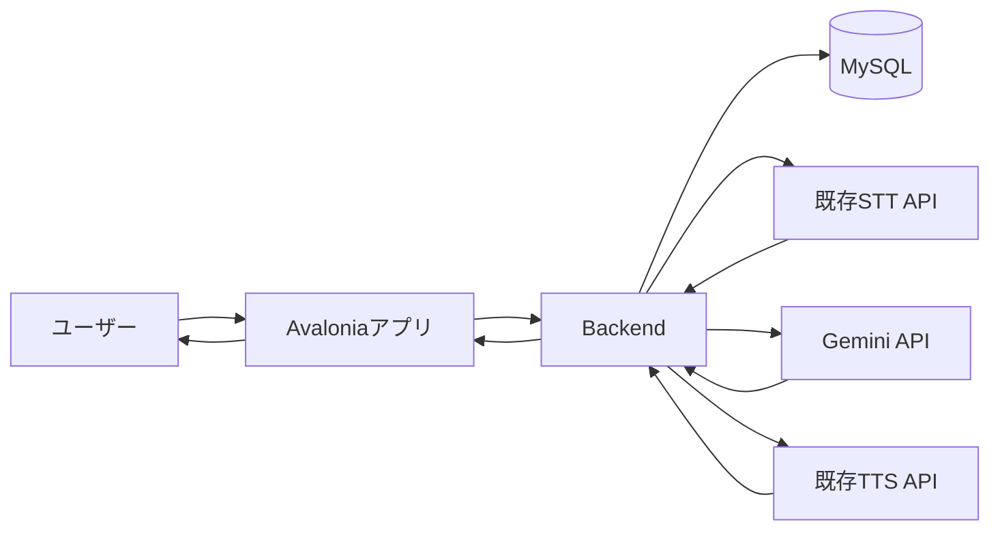
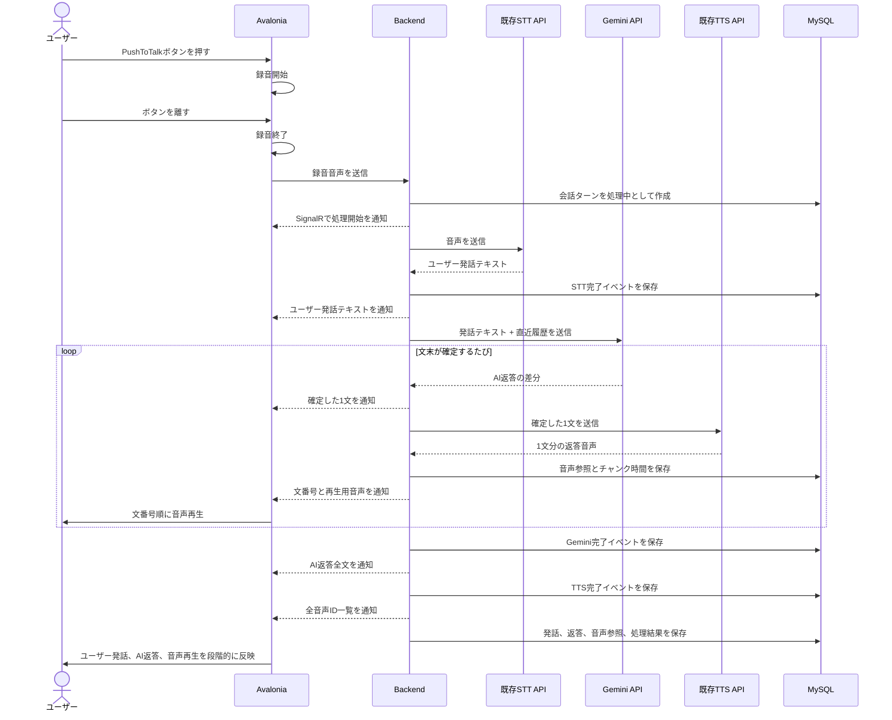
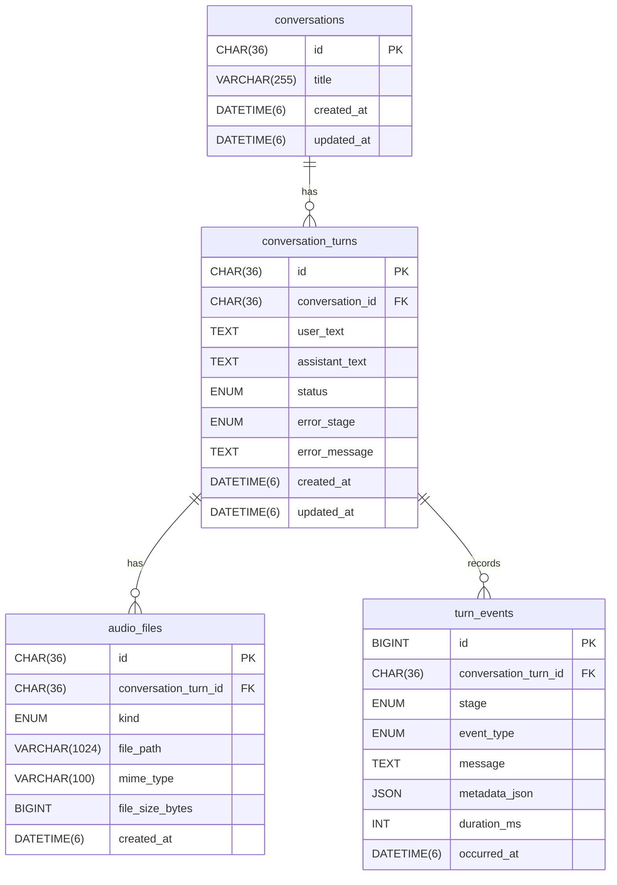

# STS音声対話システム 設計書

## 1. この設計書の目的

この設計書は、`Backend + Avalonia + MySQL` を使って、PushToTalk型の音声対話システムを作るための初期設計をまとめるものです。

現時点ではコードを書かず、まず次のことを理解しながら設計します。

- 音声対話システムを構成する部品の役割
- Avaloniaアプリ、Backend、MySQL、STT/TTS API、Gemini APIの関係
- ユーザーが話してから、AIの返答音声が再生されるまでの流れ
- 実装前に決めておくべき通信方式、保存内容、画面仕様

認証なし、1台PCで完結、汎用チャット型の音声対話を想定します。

## 2. 用語整理

| 用語 | 意味 | このシステムでの役割 |
| --- | --- | --- |
| STS | Speech To Speechの略。音声で話しかけ、音声で返答する仕組み。 | システム全体の目的。 |
| STT | Speech To Textの略。音声を文字に変換する技術。 | ユーザーの録音音声をテキスト化する。 |
| TTS | Text To Speechの略。文字を音声に変換する技術。 | Geminiの返答文を音声にする。 |
| LLM | Large Language Modelの略。文章を理解・生成するAI。 | Gemini APIがこの役割を担当する。 |
| PushToTalk | ボタンを押している間だけ録音する方式。 | ユーザーが話すタイミングを明確にする。 |
| SignalR | サーバーからアプリへリアルタイム通知できる仕組み。 | 「STT中」「TTS生成中」などの状態通知に使う候補。 |
| セッション | ひとまとまりの会話。 | 1回のチャット開始から終了までを表す。 |
| ターン | 会話の1往復。 | ユーザー発話とAI返答の組。 |
| レイテンシ | 操作してから結果が返るまでの待ち時間。 | 音声対話では体感品質に直結する。 |
| ストリーミング | 結果を完成後ではなく少しずつ返す方式。 | 将来、AI返答を逐次表示する時に使う。 |

## 3. 全体構成

構成は次の通りです。



各コンポーネントの責務は次の通りです。

| コンポーネント | 主な責務 |
| --- | --- |
| Avaloniaアプリ | 画面表示、PushToTalk、録音、チャット表示、音声再生 |
| Backend | 処理の司令塔。STT、Gemini、TTS、MySQL保存を順番に制御 |
| MySQL | 会話ログ、処理状態、エラー、音声ファイル参照を保存 |
| 既存STT API | ユーザー音声をテキストに変換 |
| Gemini API | ユーザー発話と直近履歴から返答文を生成 |
| 既存TTS API | Geminiの返答文を音声に変換 |

## 4. Gemini APIの役割

Gemini APIは、このシステムでは「会話の返答文を考える部分」として使います。

役割分担は次の通りです。

```text
ユーザー音声
  ↓
STT: 音声を文字にする
  ↓
Gemini API: 文字を理解して返答文を作る
  ↓
TTS: 返答文を音声にする
  ↓
アプリで再生
```

Gemini APIを使わない場合、STTによって「ユーザーが何を言ったか」は分かりますが、「それにどう返すか」はシステム側で判断できません。

そのためGemini APIに次の情報を渡します。

- 現在のユーザー発話テキスト
- 直近数ターンの会話履歴
- システムの振る舞いを決める指示文

Gemini APIの公式ドキュメントでは、テキスト生成、ストリーミング応答、複数ターン会話が扱えます。本システムではInteractions APIのSSEストリーミングを使い、完成した文からTTSへ渡します。高度な会話継続は将来拡張として扱います。

参考:

- Gemini API Text generation: https://ai.google.dev/gemini-api/docs/text-generation
- Gemini API Rate limits: https://ai.google.dev/gemini-api/docs/rate-limits
- Gemini API keys: https://ai.google.dev/gemini-api/docs/api-key

## 5. STT/TTS APIの扱い

STT/TTS APIは既存URLが存在しているため、このシステムで新しく設計・実装する対象ではありません。

ただし、Backendから正しく呼び出すために、次の連携仕様を設計書に記録する必要があります。

| 項目 | STT API | TTS API |
| --- | --- | --- |
| URL | Backend設定として管理し、実装前に確認 | Backend設定として管理し、実装前に確認 |
| 用途 | 音声ファイルをテキスト化 | テキストを音声化 |
| Request | 音声データ、音声形式、必要パラメータ | テキスト、話者、速度、音声形式など |
| Response | 認識テキスト、信頼度、エラー | 音声ファイル、音声URL、エラー |
| 音声形式 | wav、mp3、pcmなどを確認 | wav、mp3などを確認 |
| タイムアウト | 長い音声で待つ最大秒数 | 生成待ちの最大秒数 |
| エラー | 認識失敗、形式不正、通信失敗 | 生成失敗、文字数超過、通信失敗 |

設計上は、Backendの中に `STT連携部` と `TTS連携部` を用意し、既存APIの詳細が変わってもAvalonia側に影響しにくい形にします。

## 6. 会話フロー

初期版は一問一答型の流れにします。



## 7. Backend技術選定

<span style="color:red">Backendは `ASP.NET Core` を採用します。</span>

### 7.1 候補技術

今回のBackend候補として検討した主な技術は次の通りです。

| 技術 | 概要 | メリット | 検討点 |
| --- | --- | --- | --- |
| ASP.NET Core | .NET/C#のWeb API Backend | Avaloniaと同じC#で書ける。SignalRと相性が良い。MySQL連携も一般的。 | Python系AI/音声ライブラリを直接使う場合は、Python側の情報や事例も参照しながら進める。 |
| FastAPI | Pythonの軽量Web API Backend | AI・音声処理系ライブラリと相性が良い。APIを素早く作りやすい。 | Avaloniaと別言語になり、型共有や非同期処理の考え方が分かれる。 |
| Node.js / NestJS | TypeScriptのBackend | Web APIやリアルタイム通信に強い。 | Avaloniaと別言語。C#側との型共有や開発環境の整理が必要。 |
| Go | 高速・軽量なBackend | 単体バイナリ化しやすく、配布しやすい。 | Avaloniaとの共通部品は限定的になるため、API契約の管理を明確にする。 |
| Java / Spring Boot | Javaの大規模向けBackend | 業務システム、DB連携、大規模開発に強い。 | 今回の規模に合わせて、構成や設定項目を絞る必要がある。 |
| Avalonia内に処理を内蔵 | 別Backendを立てず、アプリ内で処理する | 構成が単純で、初期試作は速い。 | UIと処理の結びつきが強くなるため、将来のサーバー化や複数端末対応を別途考える。 |

### 7.2 ASP.NET Coreを採用する理由

今回、ASP.NET Coreを採用する主な理由は次の通りです。

- Avaloniaと同じC#で書けるため、C#/.NETの考え方をFrontend/Backendで揃えられる。
- 音声対話で多用する非同期処理を、Frontend/BackendともにC#の `async/await` で考えられる。
- `ConversationTurnDto` や `ProcessingStatus` などのDTO・enumを共有しやすい。
- BackendからAvaloniaへ処理状態を通知する場合、ASP.NET Core標準のSignalRを使いやすい。
- MySQL、HTTP Client、設定管理、ロギング、DIなどのBackendに必要な機能が揃っている。

特に大きいのは、非同期処理の考え方を揃えられる点です。

このシステムでは、録音、音声アップロード、STT待ち、Gemini応答待ち、TTS生成待ち、音声再生など、待ち時間のある処理が多く発生します。AvaloniaとBackendの両方をC#で書くことで、`async/await`、キャンセル、タイムアウト、二重送信防止などを同じ考え方で整理できます。

<span style="color:red">今回の検討では、ASP.NET Coreだからこその大きな懸念は見つかりませんでした。別Backend構成に伴う起動や運用の検討はありますが、それはASP.NET Core固有ではなく、FastAPI、Node.js、Go、Spring Bootなどを採用した場合にも同じく発生します。</span>

## 8. AvaloniaとBackendの通信方式

<span style="color:red">通信方式は `REST + SignalR` を採用します。</span>

<span style="color:red">ここでのSignalRは、ユーザーに細かい状態をすべて表示するためではなく、Backendで起きている状態変化をAvaloniaがキャッチできるようにするために使います。</span>

ユーザー向けUIでは、`応答を準備中...` のような粗い表示で良いと考えます。一方で、Backend内部やAvalonia内部では、`transcribing`、`thinking`、`synthesizing` などの詳細状態を受け取れるようにしておきます。

候補として検討した通信方式は次の3つです。

| 方式 | メリット | 検討点 | 評価 |
| --- | --- | --- | --- |
| RESTのみ | 分かりやすい。実装しやすい。 | 最終結果の取得が中心になるため、処理途中の状態を受け取るには別設計が必要。 | `応答を準備中...` のみでよい場合は成立する。 |
| REST + SignalR | RESTをメインにしつつ、Backendの詳細状態をSignalRでキャッチできる。音声対話UIと相性が良い。 | RESTの結果とSignalR通知の関係を整理する必要がある。 | 採用。 |
| gRPC | 型安全で高速。内部通信に強い。ストリーミングも扱える。 | 今回のUI状態通知では、SignalRの方が役割を分けやすい。 | 今回はREST + SignalRを採用する。 |

役割分担は次の通りです。

- REST: 会話開始、音声アップロード、履歴取得、音声ファイル取得
- SignalR: STT中、Gemini応答生成中、TTS生成中、完了、失敗などの状態通知

つまり、`命令・取得はREST`、`進捗・リアルタイム通知はSignalR` という分担にします。

初期版では、SignalRで受け取った詳細状態をすべてユーザーに見せる必要はありません。詳細状態は、内部状態管理、エラー調査、ログ、将来のUI拡張に使います。

| Backend状態 | SignalR通知 | 初期UI表示 |
| --- | --- | --- |
| `uploading` | 送る | 応答を準備中 |
| `transcribing` | 送る | 応答を準備中 |
| `thinking` | 送る | 応答を準備中 |
| `synthesizing` | 送る | 応答を準備中 |
| `completed` | 送る | 完了、チャット表示 |
| `failed` | 送る | エラー表示 |

<span style="color:red">この方針により、RESTを主役にしながら、詳細な情報を出すかどうかはおいておいても、Backend側の状態変化をAvalonia側でキャッチできるようにします。</span>

## 9. 応答体験の比較

<span style="color:red">応答体験は `文単位の逐次表示・逐次音声再生` を採用します。</span>

<span style="color:red">通信方式は `REST + SignalR` を採用しますが、SignalRで受け取った詳細状態をそのまま細かくユーザーに見せる必要はありません。ユーザー向けには自然なチャット更新を優先し、内部的には詳細状態をキャッチできるようにします。</span>

候補として検討した応答体験は次の3つです。

| 方式 | 体験 | 実装の考え方 | 補足 |
| --- | --- | --- | --- |
| 完了後まとめて表示 | STT、Gemini、TTSが全部終わってから表示・再生 | 最終結果をまとめて扱う | まとめて出せるメリットはあるが、自分の発話内容をすぐ確認できない。 |
| テキストだけ先に表示 | ユーザー発話とAI返答テキストを先に表示し、TTS音声は後から再生 | テキストと音声生成を分けて扱う | 全文と音声全体の完成待ちが残る。 |
| 文単位の逐次表示・再生 | Gemini返答を文単位で表示し、完成した文からTTS生成・再生 | SSE、SignalR、順序付き音声キューを使う | 採用。最初の音声が始まるまでの待ち時間を短縮する。 |

### 9.1 逐次表示・再生を採用する理由

<span style="color:red">自分の発話したことが即座に画面に反映されるのは、AI側の認識が間違えていないかを確認できる点でも有用です。</span>

<span style="color:red">音声対話では、次のような体験は避けたいです。</span>

```text
発話
  ↓
応答中
  ↓
待ったのに返答が全く的外れ
```

この場合、ユーザーは「自分の言い方が悪かったのか」「STTが聞き間違えたのか」「Geminiの返答がずれたのか」を判断しづらくなります。

そのため、まずSTT結果としてユーザーの発話をチャットに表示します。その後はGeminiの全文完成を待たず、文末が確定した文をアシスタントカードへ追記し、同じ文をTTSへ送って順番に再生します。

```text
録音終了
  ↓
ユーザー発話をチャットに表示
  ↓
AI返答の1文目を表示・TTS生成
  ↓
1文目を再生しながら後続文を生成
```

### 9.2 SignalRとの関係

SignalRは、ユーザーに細かい状態を全部見せるためではなく、Backend側の状態変化をAvalonia側でキャッチするために使います。

この応答体験では、SignalRで次のようなイベントを受け取れるようにします。

| SignalRイベント | Avalonia側の扱い | ユーザー向け表示 |
| --- | --- | --- |
| `transcriptionCompleted` | STT結果を受け取り、ユーザー発話として表示 | ユーザー発話の吹き出し |
| `assistantTextChunkGenerated` | 完成した文を既存のAI返答カードへ追記 | AI返答の吹き出し |
| `assistantTextCompleted` | Gemini全文を受け取り、カード本文を確定 | AI返答の吹き出し |
| `speechSynthesisChunkCompleted` | 文番号と音声IDを受け取り、順序付き再生キューへ追加 | 音声再生 |
| `speechSynthesisCompleted` | 全音声ID一覧を受け取り、取り逃した通知を補完 | 音声再生 |
| `turnFailed` | 失敗箇所を受け取り、状態を更新する | エラー表示 |

RESTは処理開始や履歴取得を担当し、SignalRは途中結果や状態変化の通知を担当します。

### 9.3 TTS失敗時の扱い

テキストだけ先に表示する方式では、Gemini返答テキストとTTS音声を分けて扱えます。

そのため、Gemini返答テキストの生成は成功したがTTS音声生成だけ失敗した場合でも、チャット上の返答は表示できます。この場合は、音声再生部分だけをエラーとして扱います。

```text
AI返答テキスト: 表示する
音声再生: 音声生成に失敗したことを表示する
```

### 9.4 文と音声の分割規則

Geminiの差分は `。`、`！`、`？`、`!`、`?`、改行で区切ります。読点や固定文字数では分割せず、ストリーム終了時に残った文は句点がなくても最後の1文として扱います。TTSは1件ずつ呼び出し、Desktopは後続音声を先読みしながら文番号順に再生します。

途中でGeminiまたはTTSが失敗した場合、既に表示・保存・再生した部分は取り消しません。部分テキストをDBへ残し、ターン全体は `failed` として記録します。

PushToTalkではユーザー発話の区切りを明確にし、その後のAI返答は文単位で逐次表示・生成・再生することで、自然さを保ちながら応答開始を早めます。

## 10. MySQLに保存する内容

MySQLには会話ログを中心に保存します。音声ファイルそのものはDBに入れず、ファイルとして保存し、DBには参照情報だけを持たせる方針です。

DBは次の4テーブルに分けます。

| テーブル | 役割 |
| --- | --- |
| `conversations` | 会話セッション全体 |
| `conversation_turns` | 1回の発話とAI返答、現在状態 |
| `audio_files` | 入力音声・出力音声のファイル参照とメタ情報 |
| `turn_events` | ターン内で起きた状態変化・エラー履歴 |

ER図は次の通りです。



<span style="color:red">`audio_files` に分けたほうがよいと判断します。1つのテーブルに情報を持たせすぎるのは避け、会話の内容と音声ファイル管理を分けます。</span>

<span style="color:red">状態を細かくキャッチする設計で、かつBackendではエラー情報を保持しているため、DB側にも状態変化やエラー履歴を記憶させます。そのため `turn_events` を分けて持ちます。</span>

### 10.1 共通方針

#### ID

IDは、テーブルごとの用途に応じて型を分けます。

<span style="color:red">今回のシステムでは、会話IDや音声ファイルIDがAPI URL、APIレスポンス、SignalR通知、ログに出る可能性があります。特に `GET /api/conversations/{id}/turns` のように、指定セッションの会話履歴を取得するAPIがあるため、UUIDを使うメリットがあります。</span>

<span style="color:red">また、今回ステータスを `turn_events` として別で持つため、処理開始時点でUUIDにより `turn_id` を先に確定できると便利です。`conversation_turns`、`turn_events`、`audio_files`、SignalR通知、ログ、音声ファイル名を同じIDで追えるようにします。</span>

<span style="color:red">一方で、すべてのテーブルでUUIDにする必要はありません。外に見える可能性の低いものについては `BIGINT` にします。特に `turn_events` は内部ログで件数が多くなるため、`INT` ではなく `BIGINT AUTO_INCREMENT` を使用します。</span>

ID方針は次の通りです。

| テーブル | ID型 | 理由 |
| --- | --- | --- |
| `conversations` | `CHAR(36)` UUID | API URLやレスポンスに出る可能性がある |
| `conversation_turns` | `CHAR(36)` UUID | SignalR通知、ログ、音声ファイル、イベントを同じIDで追う中心になる |
| `audio_files` | `CHAR(36)` UUID | 音声取得APIやログに出る可能性がある |
| `turn_events` | `BIGINT AUTO_INCREMENT` | 内部ログで件数が多くなりやすく、イベントID自体を外に出す必要が低い |

#### 日時

日時は `DATETIME(6)` を使用します。

DBにはUTCで保存し、画面表示時にローカル時刻へ変換します。

#### enum

ステータスやイベント種別はenumとして扱います。

<span style="color:red">enumの定義変更によって既存データとの対応が崩れるリスクを避けるため、BackendだけでなくDB側にも取り得る値を明示します。</span>

### conversations

会話セッションを表します。

| カラム | 型 | 意味 |
| --- | --- | --- |
| id | `CHAR(36)` | セッションID。UUID |
| title | `VARCHAR(255)` | 会話タイトル |
| created_at | `DATETIME(6)` | 作成日時。UTC |
| updated_at | `DATETIME(6)` | 更新日時。UTC |

### conversation_turns

ユーザー発話とAI返答の1往復を表します。ここでは、ターン全体の現在状態を持ちます。

| カラム | 型 | 意味 |
| --- | --- | --- |
| id | `CHAR(36)` | ターンID。UUID |
| conversation_id | `CHAR(36)` | 対象セッションID |
| user_text | `TEXT` | STTで得たユーザー発話 |
| assistant_text | `TEXT` | Geminiが生成した返答 |
| status | `ENUM('processing', 'completed', 'failed')` | ターン全体の現在状態 |
| error_stage | `ENUM('upload', 'stt', 'gemini', 'tts', 'database') NULL` | 最終的な失敗箇所 |
| error_message | `TEXT NULL` | ユーザー表示または調査用のエラー内容 |
| created_at | `DATETIME(6)` | 作成日時。UTC |
| updated_at | `DATETIME(6)` | 更新日時。UTC |

`conversation_turns.status` は、履歴一覧やチャット画面で現在状態をすぐ表示するために使います。途中で何が起きたかの詳細は `turn_events` に保存します。

### audio_files

音声ファイル本体ではなく、音声ファイルの参照情報とメタ情報を保存します。

| カラム | 型 | 意味 |
| --- | --- | --- |
| id | `CHAR(36)` | 音声ファイルID。UUID |
| conversation_turn_id | `CHAR(36)` | 対象ターンID |
| kind | `ENUM('input', 'output')` | 入力音声か出力音声か |
| file_path | `VARCHAR(1024)` | Backend側で保存している音声ファイルのパス |
| mime_type | `VARCHAR(100)` | `audio/wav` などのMIME type |
| file_size_bytes | `BIGINT NULL` | ファイルサイズ |
| created_at | `DATETIME(6)` | 作成日時。UTC |

`kind` は、ユーザーが話した録音音声を `input`、TTSで生成されたAI返答音声を `output` とします。

<span style="color:red">`audio_files.duration_ms` は、初期版では画面表示や処理判定に使用しないため、カラムから削除します。音声処理にかかった時間は `turn_events.duration_ms` で管理します。</span>

### turn_events

1つの会話ターンの中で起きた状態変化やエラー履歴を保存します。

| カラム | 型 | 意味 |
| --- | --- | --- |
| id | `BIGINT AUTO_INCREMENT` | イベントID。内部ログ用の連番 |
| conversation_turn_id | `CHAR(36)` | 対象ターンID |
| stage | `ENUM('upload', 'stt', 'gemini', 'tts', 'database')` | どの処理段階か |
| event_type | `ENUM('started', 'completed', 'failed', 'info')` | 何が起きたか |
| message | `TEXT NULL` | 表示・調査用の説明 |
| metadata_json | `JSON NULL` | APIレスポンスや補足情報 |
| duration_ms | `INT NULL` | そのイベントに対応する処理時間 |
| occurred_at | `DATETIME(6)` | イベント発生日時。UTC |

<span style="color:red">処理時間は `turn_events.duration_ms` のみに持たせます。応答が遅い時に、STT / Gemini / TTS のどこで時間がかかっているかを後から確認するために保存します。</span>

`conversation_turns` には `stt_duration_ms`、`gemini_duration_ms`、`tts_duration_ms` は持たせません。処理段階ごとの時間は `turn_events.duration_ms` を見ます。

ストリーミングではGeminiとTTSが並行するため、両者の完了時間は単純に足し合わせません。Geminiの最初の文が確定するまでの時間、各TTSチャンクの生成時間、Gemini全体、TTS全体を別イベントとして記録します。

例:

| stage | event_type | duration_ms |
| --- | --- | --- |
| `stt` | `completed` | `1200` |
| `gemini` | `completed` | `3500` |
| `tts` | `completed` | `4800` |

### インデックス・一意制約・削除方針

履歴表示とイベント追跡のため、次のカラムにはインデックスを作成します。

- `conversation_turns.conversation_id`
- `conversation_turns.created_at`
- `audio_files.conversation_turn_id`
- `audio_files.file_path`
- `turn_events.conversation_turn_id`
- `turn_events.occurred_at`

一意制約は次の方針にします。

| 対象 | 方針 | 理由 |
| --- | --- | --- |
| `audio_files.file_path` | UNIQUEを設定する | 同じ実ファイルを複数レコードが指すことを避けるため |
| `audio_files.conversation_turn_id, kind` | UNIQUEを設定しない | 1ターンに複数の入力音声・出力音声が紐づく可能性があるため |
| `turn_events.stage, event_type` | UNIQUEを設定しない | リトライや再処理で同じ段階・同じイベント種別が複数回記録される可能性があるため |
| `conversations.title` | UNIQUEを設定しない | 同じタイトルの会話が複数あってもよいため |

<span style="color:red">今後の発展方向として、発話終話の検知機能を持つ可能性があります。その場合、1ターンで何個も音声ファイルが来る可能性、出ていく可能性があるため、`audio_files(conversation_turn_id, kind)` には一意制約を付けません。</span>

会話を削除する場合は、関連する `conversation_turns`、`audio_files`、`turn_events` も削除対象とします。


## 11. Backendの主な処理

Backendは、Avaloniaから音声を受け取った後、次の流れで処理します。

1. 音声ファイルを受け取る。
2. `turn_id` を確定し、会話ターンを `processing` としてMySQLに作成する。
3. 状態変化を `turn_events` に保存し、必要に応じてSignalRでAvaloniaへ通知する。
4. STT APIを呼び出してユーザー発話テキストを得る。
5. STT結果を保存し、SignalRでAvaloniaへ通知する。
6. 直近数ターンの履歴をMySQLから取得する。
7. ユーザー発話と履歴をGemini APIへ送り、SSEで差分を受信する。
8. 文末が確定した文をSignalRで通知し、同時にTTSキューへ追加する。
9. Gemini受信を続けながら、TTSキューを1件ずつ処理する。
10. 各音声の参照情報を `audio_files` に保存し、文番号と音声IDをSignalRで通知する。
11. Gemini全文を保存し、全TTS音声が完成した後に会話ターンを `completed` として更新する。

途中で失敗した場合は、失敗箇所を `error_stage` に記録し、ターンを `failed` として保存します。あわせて、失敗イベントを `turn_events` に保存し、SignalRでAvaloniaへ通知します。

## 12. API設計の対象範囲

この設計で新しく考えるAPIは、主に `AvaloniaアプリとBackendの間のAPI` です。

STT/TTS APIは既存の接続先をBackend設定として扱うため、新しく設計しません。必要なのは連携仕様の整理です。

初期候補のBackend APIは次の通りです。

| API | 用途 |
| --- | --- |
| `POST /api/conversations` | 新しい会話セッションを開始 |
| `GET /api/conversations` | 会話セッション一覧を取得 |
| `GET /api/conversations/{id}/turns` | 指定セッションの会話履歴を取得 |
| `POST /api/conversations/{id}/turns/audio` | 録音音声を送信し、STT/Gemini/TTS処理を開始 |
| `GET /api/audio/{audioId}` | `audio_files.id` を指定して保存された音声を取得 |
| `GET /hubs/conversation` | SignalRによる処理状態通知 |

SignalRでは、状態とイベントを分けて扱います。

状態の例は次の通りです。

| 状態 | 意味 |
| --- | --- |
| `recording` | Avalonia側で録音中 |
| `uploading` | Backendへ音声送信中 |
| `transcribing` | STT処理中 |
| `thinking` | Gemini応答生成中 |
| `synthesizing` | TTS処理中 |
| `completed` | 処理完了 |
| `failed` | どこかの処理で失敗 |

イベントの例は次の通りです。

| イベント | 意味 |
| --- | --- |
| `transcriptionCompleted` | STT結果のユーザー発話テキストを通知 |
| `assistantTextChunkGenerated` | 文番号と確定した1文を通知 |
| `assistantTextCompleted` | Gemini返答全文の確定を通知 |
| `speechSynthesisChunkCompleted` | 文番号と生成済み音声IDを通知 |
| `speechSynthesisCompleted` | 全音声ID一覧とTTS全体の完了を通知 |
| `turnFailed` | 失敗箇所とエラー情報を通知 |

## 13. チャットUI設計

Avaloniaの画面は、チャットUIを中心にします。

必要な要素は次の通りです。

- 会話履歴エリア
- ユーザー発話の吹き出し
- AI返答の吹き出し
- PushToTalkボタン
- 処理状態表示
- エラー表示

画面上の基本状態は次の通りです。

| 状態 | UI表示 |
| --- | --- |
| 待機中 | PushToTalkボタンを押せる |
| 録音中 | 録音中であることを表示 |
| 応答準備中 | STT、Gemini、TTSなどの内部状態は細かく表示せず、必要に応じてまとめて表示 |
| ユーザー発話表示 | STT結果をユーザー発話の吹き出しとして表示 |
| AI返答表示 | Gemini返答をAI返答の吹き出しとして表示 |
| 音声再生 | TTS音声の生成完了後、Backendから取得して自動再生する |
| 失敗 | どの段階で失敗したか分かるメッセージを表示 |

## 14. エラー設計

音声対話では、失敗箇所によってユーザーに伝える内容が変わります。

| 失敗箇所 | 例 | ユーザー向け表示 |
| --- | --- | --- |
| 録音 | マイクが使えない | マイクを使用できません |
| STT | 音声が短すぎる、認識失敗 | 音声を文字に変換できませんでした |
| Gemini | レート制限、APIキー不正 | 返答を生成できませんでした |
| TTS | 文字数超過、生成失敗 | 音声を生成できませんでした |
| DB | 保存失敗 | 会話履歴の保存に失敗しました |
| 通信 | Backendに接続できない | サーバーに接続できません |

Gemini APIは無料枠を使う想定のため、レート制限に当たる可能性があります。制限値は変更されることがあるため、実装前に公式ドキュメントで最新値を確認します。

## 15. セキュリティと設定

認証は行いません。ただし、APIキーなどの秘密情報は安全に扱います。

- Gemini APIキーはAvaloniaアプリに置かない。
- Gemini APIキーはBackendの設定ファイルまたは環境変数で管理する。
- STT/TTS APIのURLもBackend側の設定として管理する。
- MySQL接続文字列もBackend側で管理する。
- アプリログにAPIキーや個人情報を出さない。

## 16. 実装前に確認すること

この章は、実装に入る前に確認・設定する項目を管理するためのチェックリストとする。

具体的なURL、APIキー、DB接続文字列などの環境依存情報や秘密情報は、この設計書には記載しない。

- STT APIのURL
- STT APIのRequest形式
- STT APIのResponse形式
- STT APIが受け付ける音声形式
- TTS APIのURL
- TTS APIのRequest形式
- TTS APIのResponse形式
- TTS APIが返す音声形式
- Geminiで使うモデル名
- Gemini APIキーの管理方法
- MySQLの起動方法
- 音声ファイルの保存場所
- 開発中のAvaloniaとBackendの手動起動方法
- 試用版以降のBackend自動起動方法
